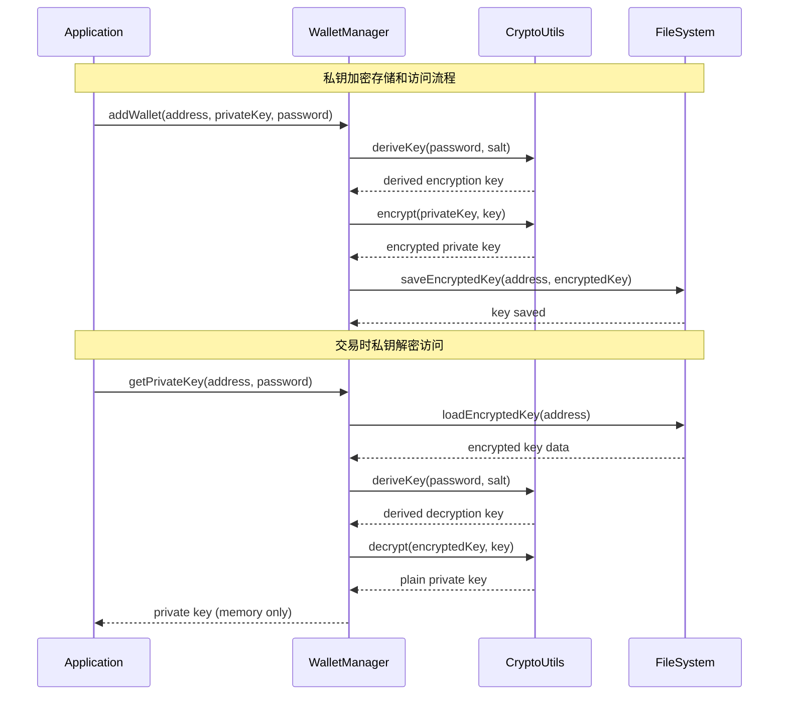

# Backend Architecture

XBoost Trader 的后端架构采用**单体 Node.js 应用**设计，专为本地执行和自动化交易优化：

## Service Architecture

由于选择了本地 Node.js 运行模式，系统采用**传统应用架构**而非 serverless 模式：

### Controller/Route Organization

```text
src/
├── controllers/        # 业务控制器（非HTTP路由）
│   ├── StrategyController.ts    # 策略管理控制器
│   ├── TradingController.ts     # 交易执行控制器
│   ├── MonitorController.ts     # 监控控制器
│   └── ConfigController.ts      # 配置管理控制器
├── services/          # 核心业务服务
│   ├── StrategyEngine.ts        # 网格策略引擎
│   ├── PriceMonitor.ts          # 价格监控服务
│   ├── RiskManager.ts           # 风险管理服务
│   ├── OKXService.ts            # OKX交易服务
│   └── NotificationService.ts   # 通知服务
├── repositories/      # 数据访问层
│   ├── StrategyRepository.ts    # 策略数据访问
│   ├── OrderRepository.ts       # 订单数据访问
│   ├── TradeRepository.ts       # 交易记录访问
│   └── BaseRepository.ts        # 基础数据访问类
├── models/           # 数据模型
│   ├── GridStrategy.ts          # 网格策略模型
│   ├── GridOrder.ts             # 网格订单模型
│   └── Trade.ts                 # 交易记录模型
├── utils/            # 工具类
│   ├── DatabaseConnection.ts    # 数据库连接
│   ├── CryptoUtils.ts           # 加密工具
│   ├── GridCalculator.ts        # 网格计算
│   └── Logger.ts                # 日志工具
└── app.ts            # 应用入口点
```

### Controller Template

```typescript
// 非HTTP的业务控制器模板
export class StrategyController {
  constructor(
    private strategyService: StrategyEngine,
    private riskManager: RiskManager,
    private repository: StrategyRepository
  ) {}

  async createStrategy(config: GridStrategyConfig): Promise<GridStrategy> {
    // 1. 输入验证
    const validation = await this.validateStrategyConfig(config);
    if (!validation.isValid) {
      throw new ValidationError(validation.message);
    }

    // 2. 风险检查
    const riskCheck = await this.riskManager.assessStrategyRisk(config);
    if (!riskCheck.approved) {
      throw new RiskError(riskCheck.reason);
    }

    // 3. 创建策略
    const strategy = await this.strategyService.createStrategy(config);
    
    // 4. 持久化
    await this.repository.save(strategy);
    
    // 5. 日志记录
    this.logger.info('Strategy created', { strategyId: strategy.id });
    
    return strategy;
  }
}
```

## Database Architecture

### Schema Design

数据库架构在前面已详细定义，这里重点说明**访问层设计**：

```sql
-- 高频查询：获取活跃策略的当前状态
SELECT 
    s.id,
    s.pair,
    s.status,
    COUNT(CASE WHEN o.status = 'pending' THEN 1 END) as pending_orders,
    COUNT(CASE WHEN o.status = 'filled' THEN 1 END) as filled_orders,
    COALESCE(SUM(t.profit), 0) as total_profit
FROM grid_strategies s
LEFT JOIN grid_orders o ON s.id = o.strategy_id
LEFT JOIN trades t ON s.id = t.strategy_id
WHERE s.status = 'active'
GROUP BY s.id;
```

### Data Access Layer

```typescript
// Repository 模式实现
export abstract class BaseRepository<T> {
  constructor(protected db: sqlite3.Database) {}

  abstract tableName: string;
  abstract mapRowToEntity(row: any): T;
  abstract mapEntityToRow(entity: T): any;

  async findById(id: string): Promise<T | null> {
    const sql = `SELECT * FROM ${this.tableName} WHERE id = ?`;
    const row = await this.queryOne(sql, [id]);
    return row ? this.mapRowToEntity(row) : null;
  }

  async save(entity: T): Promise<void> {
    const row = this.mapEntityToRow(entity);
    const columns = Object.keys(row).join(', ');
    const placeholders = Object.keys(row).map(() => '?').join(', ');
    const values = Object.values(row);
    
    const sql = `INSERT OR REPLACE INTO ${this.tableName} (${columns}) VALUES (${placeholders})`;
    await this.execute(sql, values);
  }
}
```

## Authentication and Authorization

由于是本地应用，认证机制主要聚焦于**私钥保护**而非用户身份认证：

### Auth Flow



### Middleware/Guards

```typescript
// 安全中间件：私钥访问控制
export class SecurityGuard {
  private keyCache: Map<string, { key: string; expiry: number }> = new Map();
  private readonly CACHE_TTL = 5 * 60 * 1000; // 5分钟

  async requirePrivateKey(address: string, password?: string): Promise<string> {
    // 检查缓存
    const cached = this.keyCache.get(address);
    if (cached && cached.expiry > Date.now()) {
      return cached.key;
    }

    // 如果没有密码，要求用户输入
    if (!password) {
      password = await this.promptForPassword(`Enter password for wallet ${address}:`);
    }

    try {
      const privateKey = await this.walletManager.decryptPrivateKey(address, password);
      
      // 缓存解密后的私钥（仅在内存中，有过期时间）
      this.keyCache.set(address, {
        key: privateKey,
        expiry: Date.now() + this.CACHE_TTL
      });

      return privateKey;
    } catch (error) {
      throw new AuthenticationError('Invalid password or wallet not found');
    }
  }
}
```
