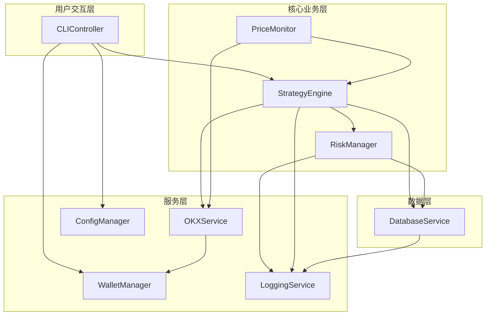

# Components

## CLIController

**Responsibility:** 处理用户命令输入，解析参数，协调其他组件执行相应操作

**Key Interfaces:**
- `executeCommand(command: string, args: any[]): Promise<CommandResult>`
- `validateInput(command: string, options: any): ValidationResult`
- `formatOutput(result: any): string`

**Dependencies:** StrategyEngine, RiskManager, PriceMonitor, ConfigManager, DatabaseService

**Technology Stack:** Commander.js + TypeScript, 输入验证使用 Joi 或 Zod

## StrategyEngine

**Responsibility:** 网格策略的核心执行引擎，负责计算网格价位、管理订单生命周期、执行交易逻辑

**Key Interfaces:**
- `createStrategy(config: GridStrategyConfig): Promise<GridStrategy>`
- `startStrategy(strategyId: string): Promise<void>`
- `stopStrategy(strategyId: string): Promise<void>`
- `processGridUpdate(priceChange: PriceUpdate): Promise<void>`
- `calculateGridLevels(strategy: GridStrategy): GridLevel[]`

**Dependencies:** OKXService, DatabaseService, RiskManager, EventEmitter

**Technology Stack:** TypeScript 类设计，使用 EventEmitter 处理异步事件，集成数学计算库处理网格算法

## PriceMonitor

**Responsibility:** 实时监控目标交易对价格变化，触发网格策略重新平衡事件

**Key Interfaces:**
- `startMonitoring(pairs: string[]): void`
- `stopMonitoring(pair?: string): void`
- `getCurrentPrice(pair: string): Promise<PriceData>`
- `subscribeToUpdates(callback: (update: PriceUpdate) => void): void`

**Dependencies:** OKXService, EventEmitter

**Technology Stack:** WebSocket 连接管理，使用 Node.js EventEmitter 实现观察者模式，内置重连机制

## RiskManager

**Responsibility:** 实施风险控制策略，包括止损检查、仓位管理、异常情况处理

**Key Interfaces:**
- `validateTrade(trade: TradeRequest): Promise<RiskCheckResult>`
- `checkStopLoss(strategy: GridStrategy, currentPrice: number): Promise<boolean>`
- `enforcePositionLimits(strategy: GridStrategy): Promise<void>`
- `handleEmergencyStop(strategyId: string, reason: string): Promise<void>`

**Dependencies:** DatabaseService, StrategyEngine

**Technology Stack:** TypeScript 规则引擎，使用策略模式实现不同风险控制规则

## OKXService

**Responsibility:** 封装 OKX DEX SDK，提供统一的交易接口和多链支持

**Key Interfaces:**
- `placeOrder(request: OrderRequest): Promise<OrderResult>`
- `cancelOrder(orderId: string, network: string): Promise<void>`
- `getBalance(address: string, network: string): Promise<Balance[]>`
- `getPrice(pair: string, network: string): Promise<PriceData>`
- `getOrderStatus(orderId: string): Promise<OrderStatus>`

**Dependencies:** OKX DEX SDK, WalletManager

**Technology Stack:** OKX DEX SDK 封装层，支持多网络切换，内置错误重试和熔断机制

## DatabaseService

**Responsibility:** 管理 SQLite 数据库操作，提供数据持久化和查询功能

**Key Interfaces:**
- `saveStrategy(strategy: GridStrategy): Promise<void>`
- `getActiveStrategies(): Promise<GridStrategy[]>`
- `recordTrade(trade: Trade): Promise<void>`
- `getTradeHistory(filters: TradeFilter): Promise<Trade[]>`
- `updateOrderStatus(orderId: string, status: OrderStatus): Promise<void>`

**Dependencies:** SQLite3

**Technology Stack:** SQLite3 + TypeScript ORM（可能使用 TypeORM 或自定义 Repository 层）

## WalletManager

**Responsibility:** 安全管理用户私钥，处理加密解密操作，支持多钱包管理

**Key Interfaces:**
- `addWallet(address: string, privateKey: string, password: string): Promise<void>`
- `getDecryptedKey(address: string, password: string): Promise<string>`
- `listWallets(): Promise<WalletInfo[]>`
- `setDefaultWallet(address: string): Promise<void>`

**Dependencies:** crypto (Node.js 内置)

**Technology Stack:** Node.js crypto 模块，AES-256-GCM 加密，PBKDF2 密钥派生

## ConfigManager

**Responsibility:** 管理应用配置文件，处理用户偏好设置和系统参数

**Key Interfaces:**
- `loadConfig(): Promise<AppConfig>`
- `saveConfig(config: AppConfig): Promise<void>`
- `updateNetworkSettings(network: string, settings: NetworkConfig): Promise<void>`
- `validateConfig(config: AppConfig): ValidationResult`

**Dependencies:** 文件系统 (fs)

**Technology Stack:** YAML 解析器 (js-yaml)，文件系统操作，配置验证 schema

## LoggingService

**Responsibility:** 统一的日志记录和审计跟踪，支持多级别日志和文件轮转

**Key Interfaces:**
- `logTrade(trade: Trade): void`
- `logError(error: Error, context: string): void`
- `logStrategy(event: StrategyEvent): void`
- `getLogHistory(filters: LogFilter): Promise<LogEntry[]>`

**Dependencies:** Winston

**Technology Stack:** Winston logger，支持文件轮转，结构化 JSON 日志格式

## Component Diagrams

