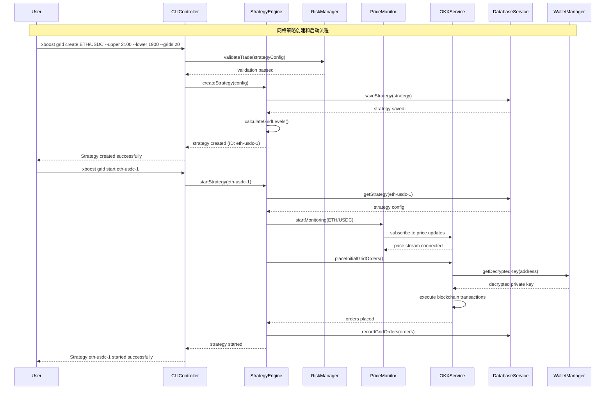
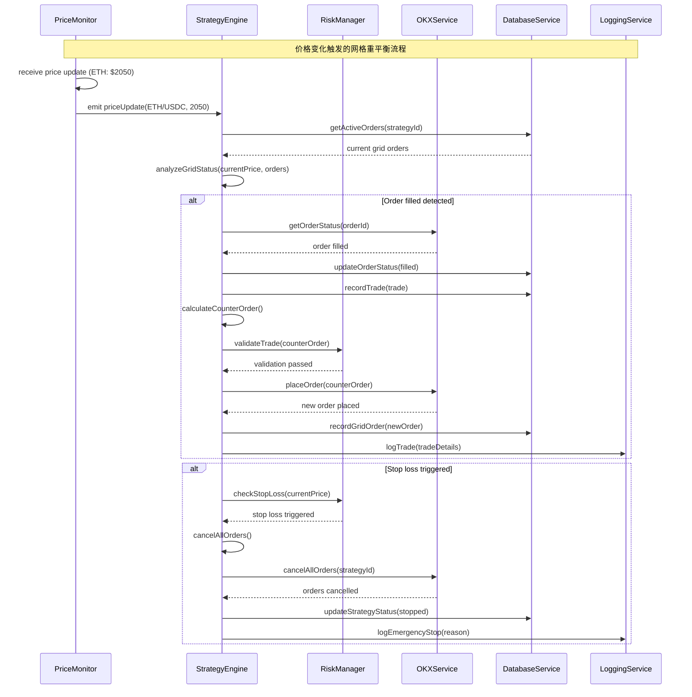

# Core Workflows

## 网格策略创建和启动流程

```mermaid
sequenceDiagram
    participant User
    participant CLI as CLIController
    participant Strategy as StrategyEngine
    participant Risk as RiskManager
    participant Monitor as PriceMonitor
    participant OKX as OKXService
    participant DB as DatabaseService
    participant Wallet as WalletManager

    Note over User, Wallet: 网格策略创建和启动流程
    
    User->>CLI: xboost grid create ETH/USDC --upper 2100 --lower 1900 --grids 20
    CLI->>Risk: validateTrade(strategyConfig)
    Risk-->>CLI: validation passed
    CLI->>Strategy: createStrategy(config)
    Strategy->>DB: saveStrategy(strategy)
    DB-->>Strategy: strategy saved
    Strategy->>Strategy: calculateGridLevels()
    Strategy-->>CLI: strategy created (ID: eth-usdc-1)
    CLI-->>User: Strategy created successfully
    
    User->>CLI: xboost grid start eth-usdc-1
    CLI->>Strategy: startStrategy(eth-usdc-1)
    Strategy->>DB: getStrategy(eth-usdc-1)
    DB-->>Strategy: strategy config
    Strategy->>Monitor: startMonitoring(ETH/USDC)
    Monitor->>OKX: subscribe to price updates
    OKX-->>Monitor: price stream connected
    Strategy->>OKX: placeInitialGridOrders()
    OKX->>Wallet: getDecryptedKey(address)
    Wallet-->>OKX: decrypted private key
    OKX->>OKX: execute blockchain transactions
    OKX-->>Strategy: orders placed
    Strategy->>DB: recordGridOrders(orders)
    Strategy-->>CLI: strategy started
    CLI-->>User: Strategy eth-usdc-1 started successfully
```

## 价格变化触发的网格重平衡流程

```mermaid
sequenceDiagram
    participant Monitor as PriceMonitor
    participant Strategy as StrategyEngine
    participant Risk as RiskManager
    participant OKX as OKXService
    participant DB as DatabaseService
    participant Log as LoggingService

    Note over Monitor, Log: 价格变化触发的网格重平衡流程
    
    Monitor->>Monitor: receive price update (ETH: $2050)
    Monitor->>Strategy: emit priceUpdate(ETH/USDC, 2050)
    Strategy->>DB: getActiveOrders(strategyId)
    DB-->>Strategy: current grid orders
    Strategy->>Strategy: analyzeGridStatus(currentPrice, orders)
    
    alt Order filled detected
        Strategy->>OKX: getOrderStatus(orderId)
        OKX-->>Strategy: order filled
        Strategy->>DB: updateOrderStatus(filled)
        Strategy->>DB: recordTrade(trade)
        Strategy->>Strategy: calculateCounterOrder()
        Strategy->>Risk: validateTrade(counterOrder)
        Risk-->>Strategy: validation passed
        Strategy->>OKX: placeOrder(counterOrder)
        OKX-->>Strategy: new order placed
        Strategy->>DB: recordGridOrder(newOrder)
        Strategy->>Log: logTrade(tradeDetails)
    end
    
    alt Stop loss triggered
        Strategy->>Risk: checkStopLoss(currentPrice)
        Risk-->>Strategy: stop loss triggered
        Strategy->>Strategy: cancelAllOrders()
        Strategy->>OKX: cancelAllOrders(strategyId)
        OKX-->>Strategy: orders cancelled
        Strategy->>DB: updateStrategyStatus(stopped)
        Strategy->>Log: logEmergencyStop(reason)
    end
```
