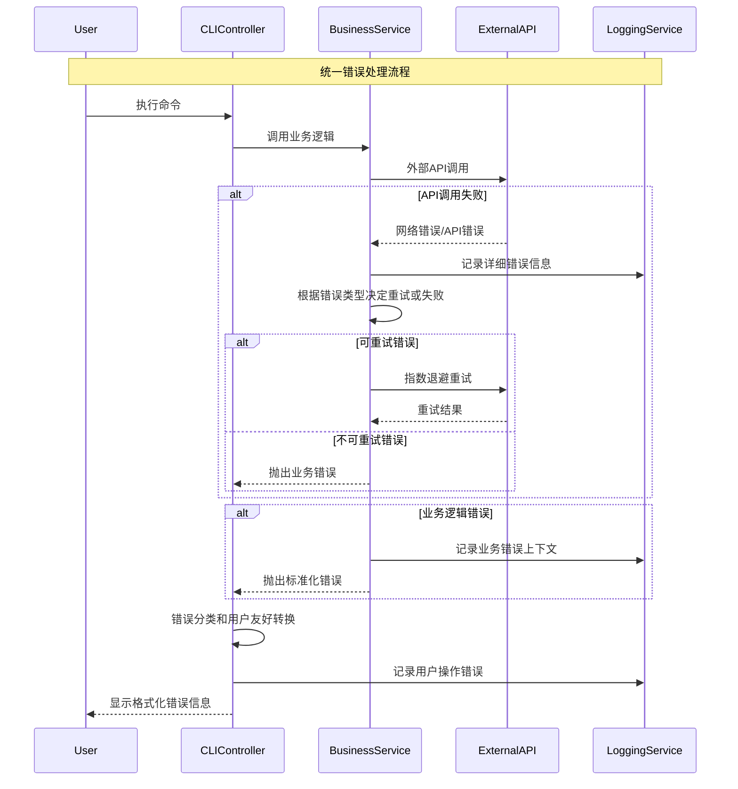

# Error Handling Strategy

## Error Flow



## Error Response Format

```typescript
interface ApiError {
  error: {
    code: string;
    message: string;
    details?: Record<string, any>;
    timestamp: string;
    requestId: string;
    category: 'validation' | 'business' | 'system' | 'network' | 'security';
    severity: 'low' | 'medium' | 'high' | 'critical';
    retryable: boolean;
  };
}
```

## Frontend Error Handling

```typescript
// CLI错误处理器
export class CLIErrorHandler {
  private logger: Logger;

  constructor(logger: Logger) {
    this.logger = logger;
  }

  handleError(error: Error, command?: string): never {
    // 记录详细错误信息
    this.logger.error('CLI command failed', {
      command,
      error: error.message,
      stack: error.stack,
      requestId: error instanceof BaseError ? error.requestId : undefined
    });

    // 根据错误类型显示用户友好信息
    if (error instanceof ValidationError) {
      this.displayValidationError(error);
    } else if (error instanceof NetworkError) {
      this.displayNetworkError(error);
    } else if (error instanceof InsufficientFundsError) {
      this.displayInsufficientFundsError(error);
    } else if (error instanceof StrategyNotFoundError) {
      this.displayStrategyNotFoundError(error);
    } else {
      this.displayGenericError(error);
    }

    process.exit(1);
  }
}
```

## Backend Error Handling

```typescript
// 服务层错误处理
export class ServiceErrorHandler {
  private logger: Logger;
  private retryConfig: RetryConfig;

  constructor(logger: Logger, retryConfig: RetryConfig) {
    this.logger = logger;
    this.retryConfig = retryConfig;
  }

  async withRetry<T>(
    operation: () => Promise<T>,
    context: { operationName: string; requestId?: string }
  ): Promise<T> {
    const { operationName, requestId } = context;
    let lastError: Error;
    
    for (let attempt = 1; attempt <= this.retryConfig.maxAttempts; attempt++) {
      try {
        const result = await operation();
        
        if (attempt > 1) {
          this.logger.info('Operation succeeded after retry', {
            operationName,
            requestId,
            attempt
          });
        }
        
        return result;
        
      } catch (error) {
        lastError = error;
        
        // 记录重试信息
        this.logger.warn('Operation failed, considering retry', {
          operationName,
          requestId,
          attempt,
          maxAttempts: this.retryConfig.maxAttempts,
          error: error.message,
          retryable: error instanceof BaseError ? error.retryable : false
        });

        // 判断是否应该重试
        if (!this.shouldRetry(error, attempt)) {
          break;
        }

        // 指数退避延迟
        const delayMs = this.calculateDelay(attempt);
        await this.sleep(delayMs);
      }
    }

    // 所有重试都失败，抛出最后一个错误
    this.logger.error('Operation failed after all retries', {
      operationName,
      requestId,
      totalAttempts: this.retryConfig.maxAttempts,
      finalError: lastError.message
    });

    throw lastError;
  }
}
```
