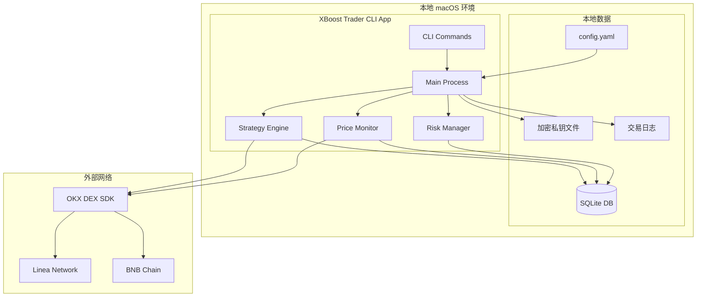

# High Level Architecture

## Technical Summary

XBoost Trader 采用**本地 Node.js CLI 应用架构**，直接在 macOS 环境中通过 npm 运行。系统使用 TypeScript 构建，集成 OKX DEX SDK 实现网格交易自动化，本地 SQLite 存储交易数据，加密文件保护私钥安全。应用采用事件驱动模式监控价格变化并自动执行交易策略，支持后台持续运行和进程管理。

## Platform and Infrastructure Choice

**Platform:** 本地 macOS + Node.js  
**Key Services:** Node.js Runtime, SQLite, PM2 进程管理器  
**Deployment Host and Regions:** 本地开发机（无需远程部署）

## Repository Structure

**Structure:** 标准 Node.js 项目结构  
**Monorepo Tool:** 不适用（单一应用）  
**Package Organization:** 按功能模块组织，核心模块直接在 src/ 目录下

## High Level Architecture Diagram

## Architectural Patterns

- **Event-Driven Architecture:** 实时价格变化触发交易事件，策略引擎响应执行买卖操作 - _Rationale:_ 网格交易需要对价格变化快速响应，事件驱动确保低延迟和高响应性
- **Strategy Pattern:** 支持等差网格、等比网格等多种算法策略 - _Rationale:_ 不同市场条件需要不同策略，策略模式便于扩展和切换
- **Command Pattern:** CLI 命令封装为可执行对象，支持撤销和日志记录 - _Rationale:_ 交易操作需要完整的审计跟踪和错误恢复机制  
- **Repository Pattern:** 抽象化数据访问，支持 SQLite 和未来可能的数据库迁移 - _Rationale:_ 便于测试和数据存储方案的灵活切换
- **Circuit Breaker Pattern:** 外部 API 调用的故障保护机制 - _Rationale:_ 网络不稳定时保护系统，避免级联失败
